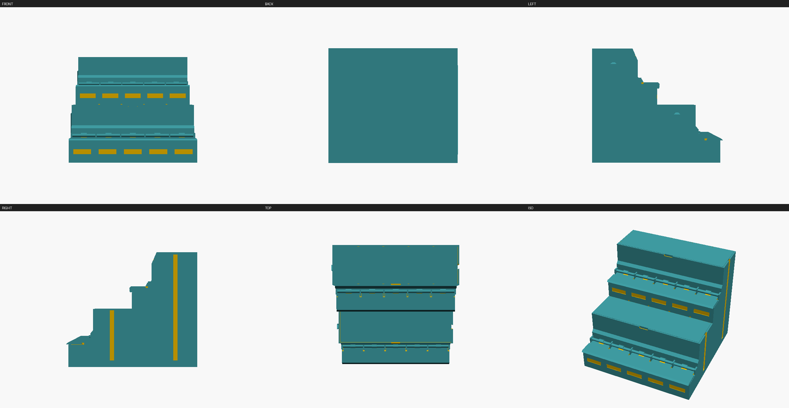

# pill_organizer_10bay

A gravity-fed bench organizer for ten supplement pills. Pour a bulk charge into
each hopper, and it feeds down a 48 degree ramp into an open pick tray. Lift one
lid and five trays are exposed; two terraced tiers give all ten.



## What it is

| | |
|---|---|
| Overall | 235 x 229.2 x 205.0 mm (the 235 includes the 5 mm joining rail) |
| Bays | 10, in two tiers of 5, 42.96 mm clear each |
| Capacity | **234.7 mL per bay, measured** — 2.35 L total |
| Design pill | 26.0 x 11.0 mm envelope (size-000 capsule, large oval softgel) |
| Printed parts | 3 designs, 5 pieces |
| Purchased parts | none |
| Printer | fits 256 mm cubed with 13 mm of bed margin |

A 90-day once-daily charge of the largest pill class is 147.4 mL, so one bay
carries it with **1.59x** margin geometrically, or **1.27x** at a realistic 80%
fill. It will not swallow a 400-count bottle in one pour — you top up.

## Bill of materials

**Printed**

| Part | Qty | Print orientation | Notes |
|---|---|---|---|
| `body` | 1 | as modelled, flat on its base | No supports. ~30 h. |
| `pick_lid` | 2 | plate face down, C-clips up | No supports. |
| `fill_lid` | 2 | **flipped** — plate top on the bed, snap tabs up | No supports. Orientation matters: modelled the other way up its underside is a 14,857 mm^2 unsupported ceiling; flipped it is 35 mm^2. |
| `calibration_coupon` | 1 | flat | **Print this first.** See below. |

**Purchased**: none. Every joint is printed-to-printed.

## Print this first

`doctor.py` reports **no calibration profile**, so this design is at tier 2:
geometry is verified, fit is not. A 6.30 mm bore is 6.30 mm in the model; what
your printer and filament produce at that number is unknown, and three fits here
are sensitive to it — the pick lid's clip on its rod, the fill lid's snap barb,
and the joining rail in its groove.

```bash
openscad --backend=Manifold --render -o coupon.stl --export-format=binstl calibration_coupon.scad
```

It prints in a few minutes and gives five graded columns. Whichever fits, put
that offset into `params.scad` before committing to a 30-hour body print.

## How it works

**Flow.** Each bay is a wedge hopper whose floor is a 48 degree ramp — 18 degrees
above the angle of repose of smooth capsules on PLA, and 42 degrees from vertical,
so its underside prints without support. Pills slide forward under the hopper's
front wall through a 30 mm outlet (1.15x the longest pill, so any pill passes in
any orientation) and pile in the tray at their own angle of repose, which is what
stops the flow. The outlet ceiling is chamfered so the throat *diverges* as pills
leave it.

**The honest caveat**: a 42.96 mm bay is 1.65x the longest pill, and the rule of
thumb for reliable mass flow is 2x-3x. Two capsules can in principle span it. The
steep ramp, the tall slot and the intermittent draw all work against that, but an
occasional tap on the case may be needed — which is true of every gravity pill
dispenser. Going wider means 4 bays per tier, which loses two pill types.

**The pick lid stays open by itself.** It swings back to a hard stop at **111.7
degrees** against the hopper wall, and its mass centre crosses the pivot at
**107.0 degrees** — so past 107 it is falling *open*, not shut. Both numbers are
measured from the rendered mesh, not calculated; two hand calculations of the
stop angle were both wrong. Getting that 4.7 degree margin is why the hopper's
front wall steps back by two wall thicknesses above `lid_stop_z`: with a flat
wall the stop landed at 102.9 and the lid fell shut.

**The fill lid** drops into the mouth and lands flush with the rim on four
divider tops, retained by two cantilever snap tabs. The tabs are 13 mm long and
1.5 mm thick because peak bending strain for a cantilever is `3td/2L^2` and PLA
is good for a percent or two — a short stubby tab at this engagement would be
near 10% and would snap off. Both snaps in this design are held under 1.5%.

**Ganging modules.** A male rail on the left face, a groove on the right. Lower
the next module alongside and both rails engage progressively; the groove floor
registers them flush at the bottom. The rail is a trapezoid defined by two
explicit widths and extruded along Z — never by a flank angle, because a
flank-angle trapezoid that exceeds half its own width renders a self-intersecting
bowtie (a real failure logged upstream), and extruding along Z means no flank
overhangs at all.

## Build and verify

```bash
cd scad-workbench && ./install.sh && source ~/.local/opt/openscad/env.sh
cd projects/pill_organizer_10bay
bash ~/.local/src/openscad-cad-skills/scad-modeler/scripts/validate_scad.sh --all
```

Last run: **14 passed, 0 failed, 3 not-applicable, 0 inconclusive, 1 advisory.**

Export for printing:

```bash
for p in body pick_lid fill_lid; do
  openscad --backend=Manifold --render -o build/$p.stl --export-format=binstl parts/$p.scad
done
```

Look at it in the round rather than trusting the stills — `build/assembly.stl`
opens in any slicer or mesh viewer, and `-D 'MODE="open"'` renders it with both
lids swung to their measured stop.

## Confidence

**Tier 2 — geometry verified, fit uncalibrated.** What that means concretely:

- Every dimension, every clearance and every bay is verified against the rendered
  mesh by `check_dimensions.py`, `check_connectivity.py`, `check_features.py`,
  `check_bore_reachability.py`, `check_subfeature_overlap.py`,
  `check_attachment.py`, `check_collisions.py` and `motion_sweep.py`.
- The lid swing is swept at 0.5 degree steps over both tiers. Sampling is not
  proof: a clash narrower than 0.5 degrees could be missed.
- **Whether the snaps snap** on your printer is not verified by any of this, and
  cannot be until the coupon is printed. Do that first.
- Nothing here is load-bearing and nothing is a pressure seal. It is a box that
  holds pills on a kitchen counter.
