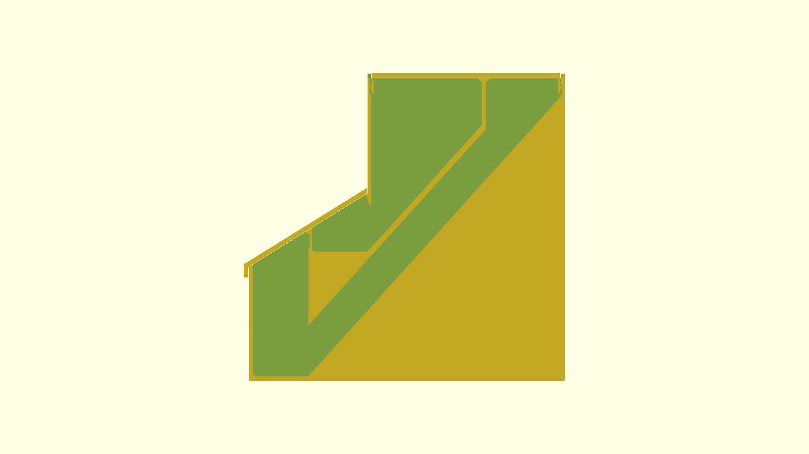

# pill_organizer_10bay

A gravity-fed bench organizer for ten supplement pills. **Both fill ports at the
back under one lid, both pick trays at the front under one lid — two lids total.**
Pour a bulk charge into each hopper at the back; it feeds down a 48 degree ramp
into an open pick tray at the front.


## What it is

| | |
|---|---|
| Overall | 235 x 205.5 x 200 mm (the 235 includes the 5 mm joining rail) |
| Bays | 10, two rows of 5, 42.96 mm clear each |
| Capacity | **380.9 mL/bay front row, 272.8 mL/bay back row** — 3.27 L total |
| Design pill | 26.0 x 11.0 mm envelope (size-000 capsule, large oval softgel) |
| Printed parts | **3 designs, 3 pieces**, no hardware |
| Validation | **13 passed, 0 failed, 4 n/a, 0 inconclusive, 1 advisory** |
| Confidence | Tier 2 — geometry verified, fit uncalibrated |

A 90-day once-daily charge of the largest pill class is 147.4 mL, so the front
row carries it with **2.58x** margin and the back row with **1.85x** (2.07x and
1.48x at a realistic 80% fill).

## The one thing to understand before printing

Putting both ports at the back and both trays at the front **forces one feed to
cross the other**. That is topological, not a detail:

- **Hopper B** is the front mouth and feeds the tray right in front of it. Plain
  ramp, no crossing.
- **Hopper A** is the back mouth but feeds the *front* tray, so its chute ducks
  under tray B and under hopper B's ramp — **159 mm enclosed**.

Two consequences, both unavoidable:

1. **The two tray rows sit 48 mm apart in rim height.** Tray B's floor has to
   clear the chute's ceiling, and that number falls straight out of the chute
   clearance at 48 degrees. `params.scad` asserts it.
2. **Half the bays feed through a chute you cannot reach into.** It is open at
   *both* ends — tray A one end, hopper A's mouth the other — so a dowel pushes
   straight through, and both paths are declared in `bores.json` and walked
   automatically. But it is not an open ramp, and that is the price of the layout.



*Cutaway through one bay: tray A bottom-left, tray B above it, the crossing chute
running up-right at 48 degrees under both, and the two hopper mouths at the top
sharing one lid.*

## Bill of materials

**Printed**

| Part | Qty | Print orientation | Notes |
|---|---|---|---|
| `body` | 1 | as modelled, flat on its base | No supports. |
| `pick_lid` | 1 | **rotate -31.9 deg about X** so the plate lies flat, hook up | No supports. NOT as modelled — it is modelled already tilted onto the pick plane. |
| `fill_lid` | 1 | **flipped** — plate top on the bed, snap tabs up | No supports. Modelled the other way up its underside is a 14,857 mm^2 unsupported ceiling; flipped it is 35 mm^2. |
| `calibration_coupon` | 1 | flat | **Print this first.** |

**Purchased**: none. Every joint is printed-to-printed.

## Print this first

`doctor.py` reports **no calibration profile**, so this is tier 2: geometry
verified, fit not. Two fits here are sensitive — the fill lid's snap barb and the
joining rail in its groove.

```bash
openscad --backend=Manifold --render -o coupon.stl --export-format=binstl calibration_coupon.scad
```

Five graded columns; whichever fits, put that offset into `params.scad` before
committing to the long body print.

## How it works

**Flow.** Each bay is a wedge hopper whose floor is a 48 degree ramp — 18 degrees
above the angle of repose of smooth capsules on PLA, and 42 degrees from vertical
so its underside prints without support. Pills pile in the tray at their own angle
of repose, which is what stops the flow.

**The chute's ceiling runs parallel to its floor**, holding a constant 33 mm
section the whole way. Following tray B's flat underside instead left 7,197 mm^2
of flat ceiling bridging 43 mm across every bay — the single worst print risk in
the part. Sloped, it self-supports; the body is now down to 1,105 mm^2 of flat
ceiling, none of it one large span.

**Neither lid is hinged, and that is forced.** An L-section lid bridging the 48 mm
rim step has its mass centre ~48 mm below any back-top pivot, putting its
over-centre angle near 144 degrees — unreachable, so it falls shut every time. A
front pivot runs the far corner into the benchtop at ~24 degrees. So:

- The **pick lid** is one flat plate lying on a single 31.9 degree plane (the body's
  walls over both trays all die on that plane, which is what makes one flat plate
  cover two rows 48 mm apart). It hangs on a hook over the front top edge — PLA on
  PLA grips to about 17 degrees and this slope is 32, so friction alone would let
  it slide off. Lift the front edge to remove.
- The **fill lid** drops into the shared mouth and lands flush with the rim on the
  divider tops, retained by two cantilever snap tabs. The tabs are 10 mm long and
  1.2 mm thick because hopper A's floor has climbed to within 12 mm of the seat by
  the back wall — that, not the strain formula, caps their length, so they are
  thinned rather than lengthened to stay under the 1.5% strain budget.

**Ganging modules.** Male rail on the left face, groove on the right. Lower the
next module alongside and both rails engage progressively. The rail is a trapezoid
defined by two explicit widths and extruded along Z — never by a flank angle,
because a flank-angle trapezoid exceeding half its own width renders a
self-intersecting bowtie, and extruding along Z means no flank overhangs.

## Build and verify

```bash
cd scad-workbench && ./install.sh && source ~/.local/opt/openscad/env.sh
cd projects/pill_organizer_10bay
bash ~/.local/src/openscad-cad-skills/scad-modeler/scripts/validate_scad.sh --all
```

Last run: **13 passed, 0 failed, 4 not-applicable, 0 inconclusive, 1 advisory.**

Look at it in the round rather than trusting the stills — `build/assembly.stl`
opens in any slicer, and `-D 'MODE="open"'` renders it with both lids clear.

## Confidence

**Tier 2 — geometry verified, fit uncalibrated.**

- Every dimension, clearance and bay is verified against the rendered mesh by the
  checker suite; both lids clear the body (0.150 mm and 0.170 mm, both intended).
- **Nothing in this revision moves**, so there is no motion sweep to run. That is
  a real reduction in what has been verified compared with the hinged revision.
- **Whether the snaps snap** on your printer is not verified and cannot be until
  the coupon is printed. Do that first.
- Nothing here is load-bearing and nothing is a seal. It is a box that holds pills
  on a kitchen counter.
